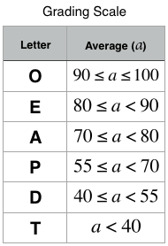

## Day 12 Inheritance

---

**Objective**
Today, we're delving into Inheritance. Check out the attached tutorial for learning materials and an instructional video.

<br />

**Task**
You are given two classes, Person and Student, where Person is the base class and Student is the derived class. Completed code for Person and a declaration for Student are provided for you in the editor. Observe that Student inherits all the properties of Person.

Complete the Student class by writing the following:

- A Student class constructor, which has parameters:
  A string, _firstName_.  
  A string, _lastName_.  
  An integer, _idNumber_.  
  An integer array (or vector) of test scores, _scores_.
- A char calculate() method that calculates a Student object's average and returns the grade character representative of their calculated average:



<br />

**Input Format**

The locked stub code in the editor reads the input and calls the Student class constructor with the necessary arguments. It also calls the calculate method which takes no arguments.

The first line contains _firstName_, _lastName_, and _idNumber_, separated by a space. The second line contains the number of test scores. The third line of space-separated integers describes _scores_.

<br />

**Constraints**

- 1 &#8804; length of firstName, length of lastName &#8804; 10
- length of idNumber = 7
- 0 &#8804; _score_ &#8804; 100

<br />

**Output Format**

Output is handled by the locked stub code. Your output will be correct if your Student class constructor and calculate() method are properly implemented.

<br />

**Sample Input**

```
Heraldo Memelli 8135627
2
100 80
```

<br />

**Sample Output**

```
Name: Memelli, Heraldo
ID: 8135627
Grade: O
```

<br />

**Explanation**

This student had 2 scores to average: 100 and 80. The student's average grade is (100 + 80) / 2 = 90. An average grade of 90 corresponds to the letter grade _O_, so the calculate() method should return the character 'O'.
