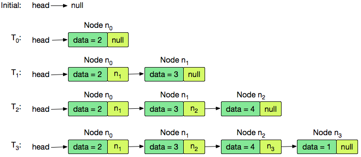

## Day 15 Linked List

---

**Objective**  
Today we will work with a Linked List. Check out the Tutorial tab for learning materials and an instructional video.

---

A Node class is provided for you in the editor. A Node object has an integer data field, _data_, and a Node instance pointer, _next_, pointing to another node (i.e.: the next node in the list).

A Node insert function is also declared in your editor. It has two parameters: a pointer, _head_, pointing to the first node of a linked list, and an integer, _data_, that must be added to the end of the list as a new Node object.

<br />

**Task**  
Complete the insert function in your editor so that it creates a new Node (pass _data_ as the Node constructor argument) and inserts it at the tail of the linked list referenced by the _head_ parameter. Once the new node is added, return the reference to the _head_ node.

**Note**: The _head_ argument is null for an empty list.

<br />

**Input Format**

The first line contains T, the number of elements to insert.
Each of the next _T_ lines contains an integer to insert at the end of the list.

<br />

**Output Format**

Return a reference to the _head_ node of the linked list.

<br />

**Sample Input**

```
STDIN   Function
-----   --------
4       T = 4
2       first data = 2
3
4
1       fourth data = 1
```

<br />

**Sample Output**

```
2 3 4 1
```

<br />

**Explanation**

_T = 4_, so your method will insert 4 nodes into an initially empty list.
First the code returns a new node that contains the data value 2 as the _head_ of the list. Then create and insert nodes 3, 4, and 1 at the tail of the list.


<br />

**Solution**

> 연결리스트를 구현하고 head 노드값을 출력한다.

<br />

**Code**

```javascript
function Solution() {
  this.insert = function (head, data) {
    let node = new Node(data);

    if (!head) {
      head = node;
    } else {
      let current = head;

      while (current.next != null) {
        current = current.next;
      }
      current.next = node;
    }
    return head;
  };

  this.display = function (head) {
    var start = head;
    while (start) {
      process.stdout.write(start.data + " ");
      start = start.next;
    }
  };
}
```
