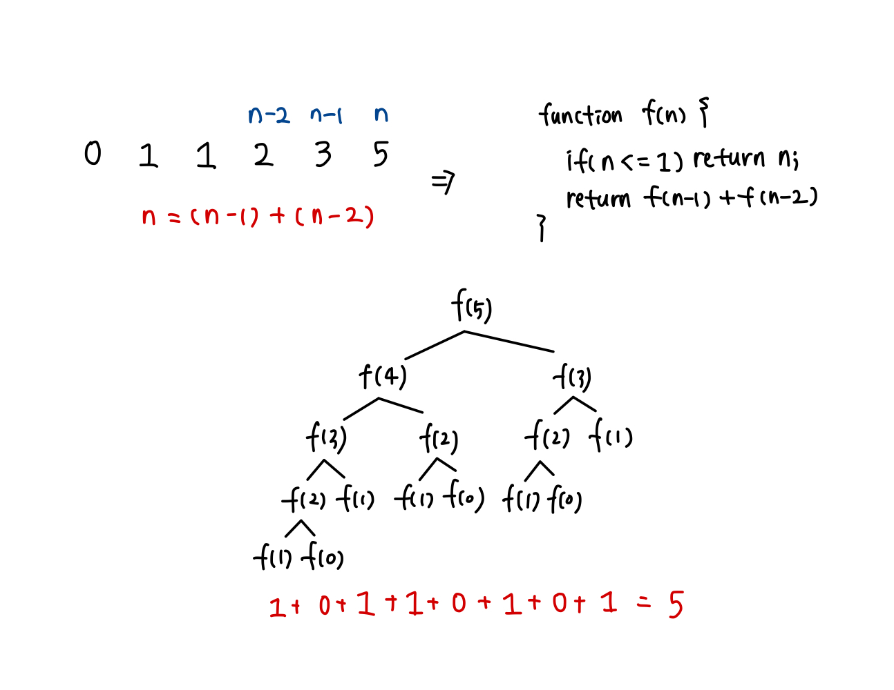

## 📮 10870 - 피보나치 수5
---

### 문제
피보나치 수는 0과 1로 시작한다. 0번째 피보나치 수는 0이고, 1번째 피보나치 수는 1이다. 그 다음 2번째 부터는 바로 앞 두 피보나치 수의 합이 된다.

이를 식으로 써보면 Fn = Fn-1 + Fn-2 (n ≥ 2)가 된다.
n=17일때 까지 피보나치 수를 써보면 다음과 같다.   
0, 1, 1, 2, 3, 5, 8, 13, 21, 34, 55, 89, 144, 233, 377, 610, 987, 1597

n이 주어졌을 때, n번째 피보나치 수를 구하는 프로그램을 작성하시오.

<br />

### 입력
첫째 줄에 n이 주어진다. n은 20보다 작거나 같은 자연수 또는 0이다.

<br />

### 출력
첫째 줄에 n번째 피보나치 수를 출력한다.

<br />

### Code
```javascript
const fs = require('fs');
const input = fs.readFileSync("/dev/stdin").toString().trim();

function fibonacci(n) {
  if ( n <= 1 ) {
    return n;
  }
  return fibonacci(n-1) + fibonacci(n-2);
}

console.log(fibonacci(Number(input)));
```

<br />

### Comment
