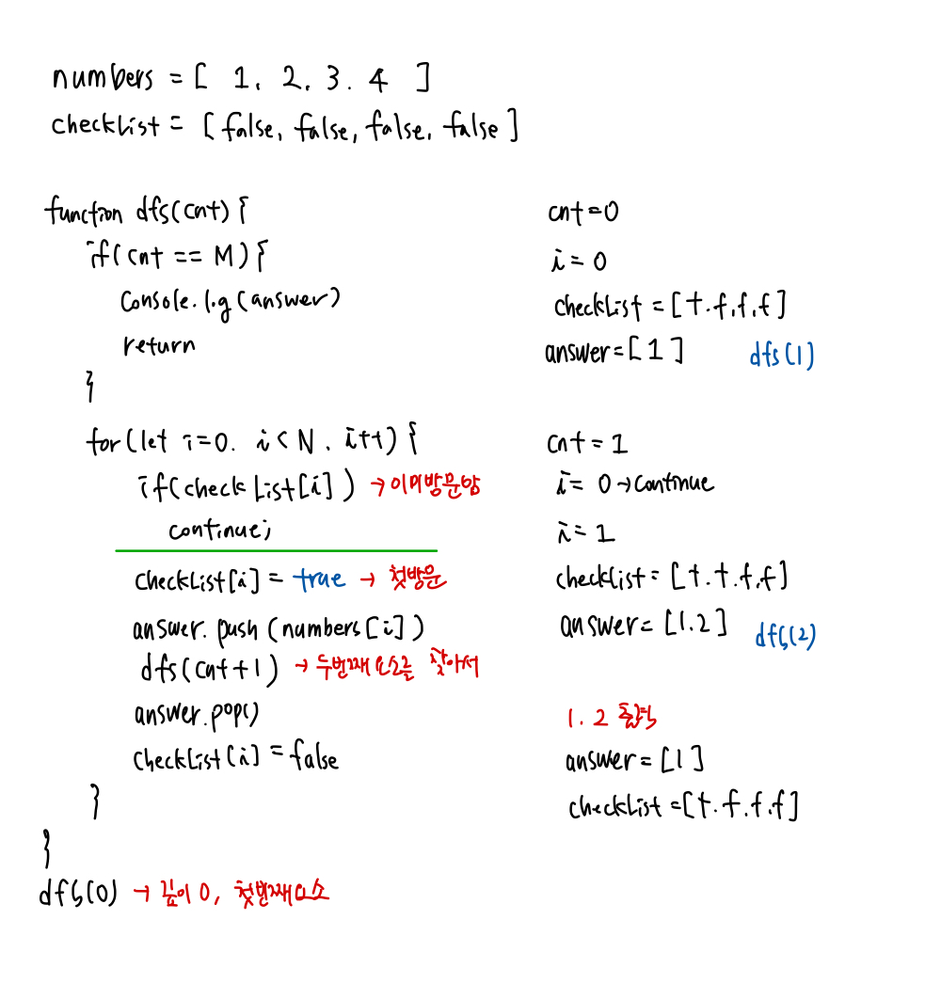

## 📮 15649 N과 M (1)

---

### 문제

자연수 N과 M이 주어졌을 때, 아래 조건을 만족하는 길이가 M인 수열을 모두 구하는 프로그램을 작성하시오.

1부터 N까지 자연수 중에서 중복 없이 M개를 고른 수열

<br />

### 입력

첫째 줄에 자연수 N과 M이 주어진다. (1 ≤ M ≤ N ≤ 8)

<br />

### 출력

한 줄에 하나씩 문제의 조건을 만족하는 수열을 출력한다. 중복되는 수열을 여러 번 출력하면 안되며, 각 수열은 공백으로 구분해서 출력해야 한다.

수열은 사전 순으로 증가하는 순서로 출력해야 한다.

<br />

### Code

```javascript
const fs = require("fs");
const input = fs.readFileSync("/dev/stdin").toString().trim().split(" ");

const N = parseInt(input[0]);
const M = parseInt(input[1]);

let answer = [];
let numbers = Array(N)
  .fill()
  .map((v, i) => i + 1);
let checkList = Array(N).fill(false);

function dfs(cnt) {
  if (cnt == M) {
    console.log(answer.join(" "));
    return;
  }
  for (let i = 0; i < N; i++) {
    if (checkList[i]) continue;
    checkList[i] = true;
    answer.push(numbers[i]);
    dfs(cnt + 1);
    answer.pop();
    checkList[i] = false;
  }
}

dfs(0);
```

<br />

### Comment

**백트래킹 알고리즘**

- 모든 경우의 수를 전부 고려하는 알고리즘. 상태공간을 트리로 나타낼 수 있을 때 적합한 방식이다.
- 경우의 수 구하기는 일반적으로 DFS가 편리하다. ( 트리의 깊이가 무한대일 때를 제외)
- 조건이 맞지 않는 경우 중단하고 이전으로 돌아가서 다시 확인을 반복하는 알고리즘

**풀이**

- numbers: 1 ~ N까지 숫자가 들어있는 배열
- checkList: 방문했는지 여부가 담긴 배열
- cnt: 배열의 길이 ➡️ cnt와 N과 같아지면 결과값을 출력한다.
  
