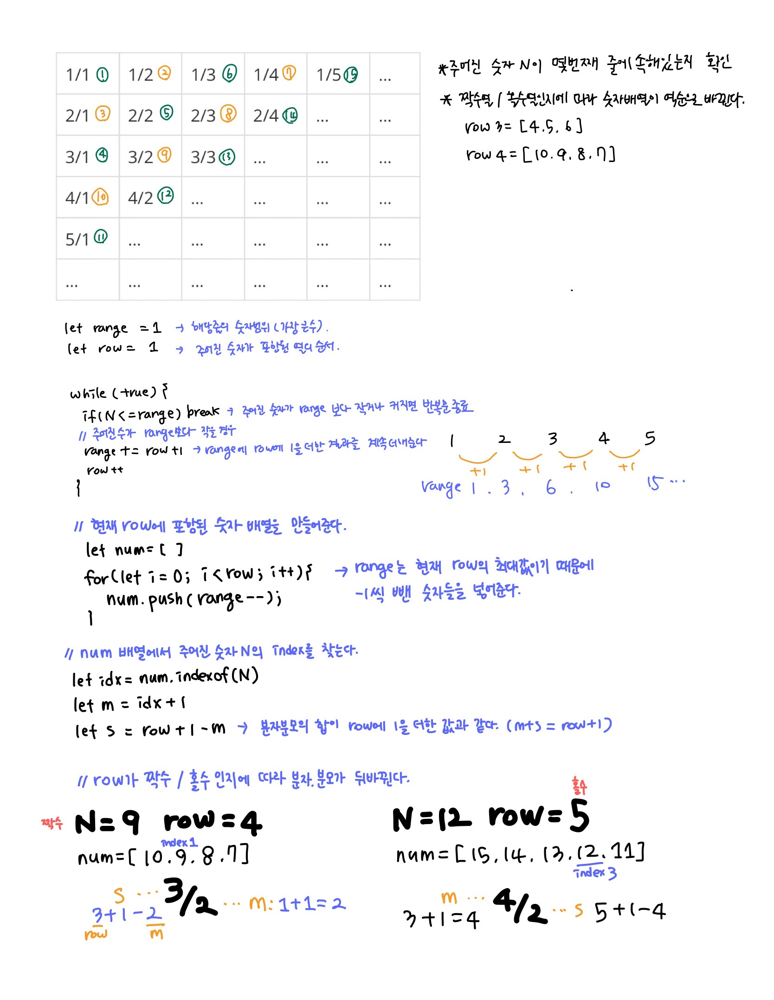

## 📮 1193 분수찾기

---

### 문제

> **🛼** 무한히 큰 배열에 다음과 같이 분수들이 적혀있다.  
> 1/1 1/2 1/3 1/4 1/5 …  
> 2/1 2/2 2/3 2/4 … …  
> 3/1 3/2 3/3 … … …  
> 4/1 4/2 … … … …  
> 5/1 … … … … …  
> … … … … … …  
> 이와 같이 나열된 분수들을 1/1 → 1/2 → 2/1 → 3/1 → 2/2 → … 과 같은 지그재그 순서로 차례대로 1번, 2번, 3번, 4번, 5번, … 분수라고 하자.  
> X가 주어졌을 때, X번째 분수를 구하는 프로그램을 작성하시오.

<br />

### 입력

첫째 줄에 X(1 ≤ X ≤ 10,000,000)가 주어진다.

<br />

### 출력

첫째 줄에 분수를 출력한다.

<br />

### Code

```javascript
const fs = require("fs");
const input = fs.readFileSync("/dev/stdin").toString().trim();

let N = Number(input);
let range = 1;
let row = 1;

while (true) {
  if (N <= range) break;

  range += row + 1;
  row++;
}
let num = [];
for (let i = 0; i < row; i++) {
  num.push(range--);
}

let idx = num.indexOf(N);
let m = idx + 1;
let s = row + 1 - m;

console.log(row % 2 === 0 ? `${s}/${m}` : `${m}/${s}`);
```

<br />

### Comment


