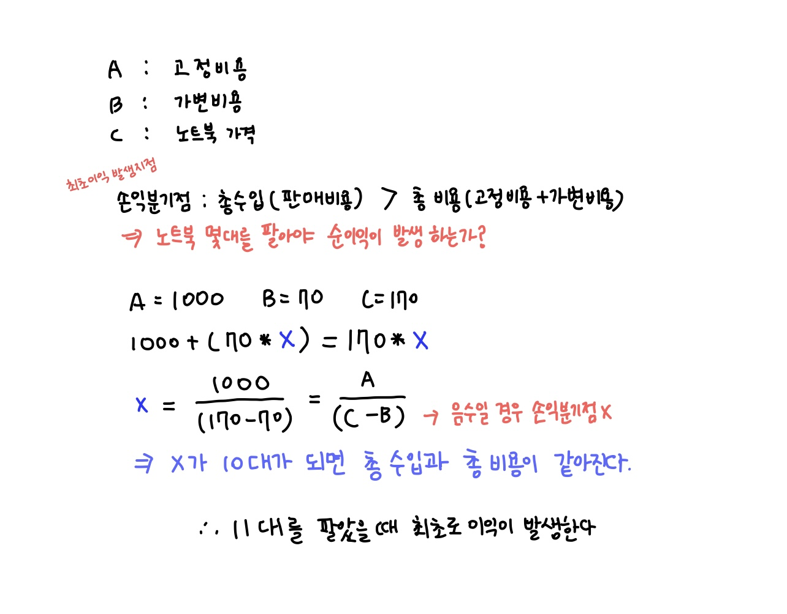

## 📮 1712 손익분기점
---

### 문제
> **🛼** 월드전자는 노트북을 제조하고 판매하는 회사이다. 노트북 판매 대수에 상관없이 매년 임대료, 재산세, 보험료, 급여 등 A만원의 고정 비용이 들며, 한 대의 노트북을 생산하는 데에는 재료비와 인건비 등 총 B만원의 가변 비용이 든다고 한다.   
>예를 들어 A=1,000, B=70이라고 하자. 이 경우 노트북을 한 대 생산하는 데는 총 1,070만원이 들며, 열 대 생산하는 데는 총 1,700만원이 든다.   
노트북 가격이 C만원으로 책정되었다고 한다. 일반적으로 생산 대수를 늘려 가다 보면 어느 순간 총 수입(판매비용)이 총 비용(=고정비용+가변비용)보다 많아지게 된다. 최초로 총 수입이 총 비용보다 많아져 이익이 발생하는 지점을 손익분기점(BREAK-EVEN POINT)이라고 한다.   
A, B, C가 주어졌을 때, 손익분기점을 구하는 프로그램을 작성하시오.

<br />

### 입력
첫째 줄에 A, B, C가 빈 칸을 사이에 두고 순서대로 주어진다. A, B, C는 21억 이하의 자연수이다.

<br />

### 출력
첫 번째 줄에 손익분기점 즉 최초로 이익이 발생하는 판매량을 출력한다. 손익분기점이 존재하지 않으면 -1을 출력한다.

<br />

### Code
```javascript
const fs = require('fs');
const input = fs.readFileSync("/dev/stdin").toString().trim().split(" ");

let A = Number(input[0]);
let B = Number(input[1]);
let C = Number(input[2]);

let margin = C - B;
let result = Math.floor(A / margin) + 1;
console.log(margin <= 0 ? -1 : result)
```

<br />

### Comment

