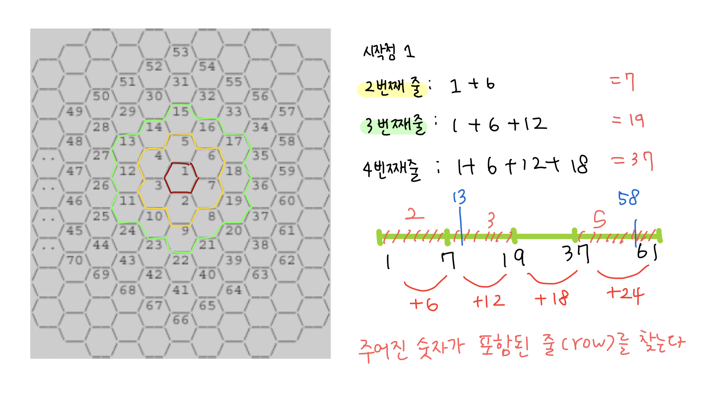

## 📮 2292 벌집

---

### 문제

> **🛼** 위의 그림과 같이 육각형으로 이루어진 벌집이 있다. 그림에서 보는 바와 같이 중앙의 방 1부터 시작해서 이웃하는 방에 돌아가면서 1씩 증가하는 번호를 주소로 매길 수 있다. 숫자 N이 주어졌을 때, 벌집의 중앙 1에서 N번 방까지 최소 개수의 방을 지나서 갈 때 몇 개의 방을 지나가는지(시작과 끝을 포함하여)를 계산하는 프로그램을 작성하시오. 예를 들면, 13까지는 3개, 58까지는 5개를 지난다.

<br />

### 입력

첫째 줄에 N(1 ≤ N ≤ 1,000,000,000)이 주어진다.

<br />

### 출력

입력으로 주어진 방까지 최소 개수의 방을 지나서 갈 때 몇 개의 방을 지나는지 출력한다.

<br />

### Code

```javascript
const fs = require("fs");
const input = fs.readFileSync("/dev/stdin").toString().trim();

let N = Number(input);
let range = 1;
let row = 1;

while (true) {
  if (N <= range) break;
  range += 6 * row;
  row++;
}
console.log(row);
```

<br />

### Comment

벌집의 주소의 패턴을 찾자!



- 주어진 숫자가 range보다 클 경우는 range에 현재 row에 6을 곱한수를 더해서 range를 증가시켜주고 row는 1을 증가시켜준다.
- while 반복문을 돌면서 주어진 숫자가 range 보다 작거나 같을 경우 반복문을 종료시켜준다.
