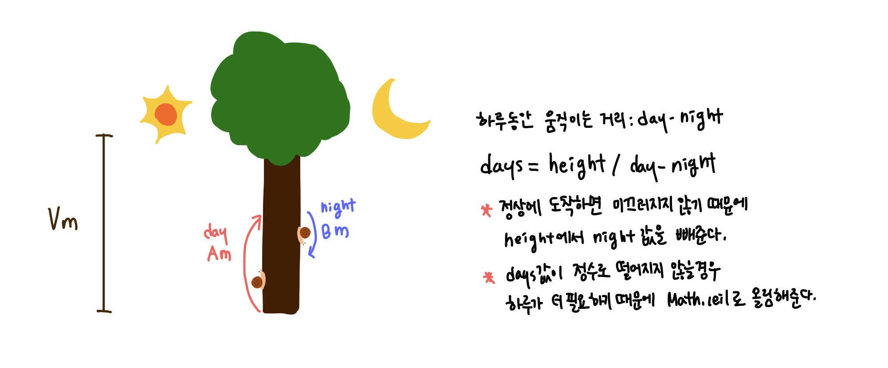

## 📮 2869 달팽이는 올라가고 싶다.
---

### 문제
> **🛼** 땅 위에 달팽이가 있다. 이 달팽이는 높이가 V미터인 나무 막대를 올라갈 것이다.   
달팽이는 낮에 A미터 올라갈 수 있다. 하지만, 밤에 잠을 자는 동안 B미터 미끄러진다. 또, 정상에 올라간 후에는 미끄러지지 않는다.   
달팽이가 나무 막대를 모두 올라가려면, 며칠이 걸리는지 구하는 프로그램을 작성하시오.

<br />

### 입력
첫째 줄에 세 정수 A, B, V가 공백으로 구분되어서 주어진다. (1 ≤ B < A ≤ V ≤ 1,000,000,000)

<br />

### 출력
첫째 줄에 달팽이가 나무 막대를 모두 올라가는데 며칠이 걸리는지 출력한다.

<br />

### Code
```javascript
const fs = require('fs');
const input = fs.readFileSync("/dev/stdin").toString().trim().split(" ");

const day = Number(input[0]);
const night = Number(input[1]);
const height = Number(input[2]);

console.log(Math.ceil((height - night)/(day - night)))
```

<br />

### Comment
* 반복문을 돌면 시간초과가 되기 때문에 계산식을 만들어준다. 
