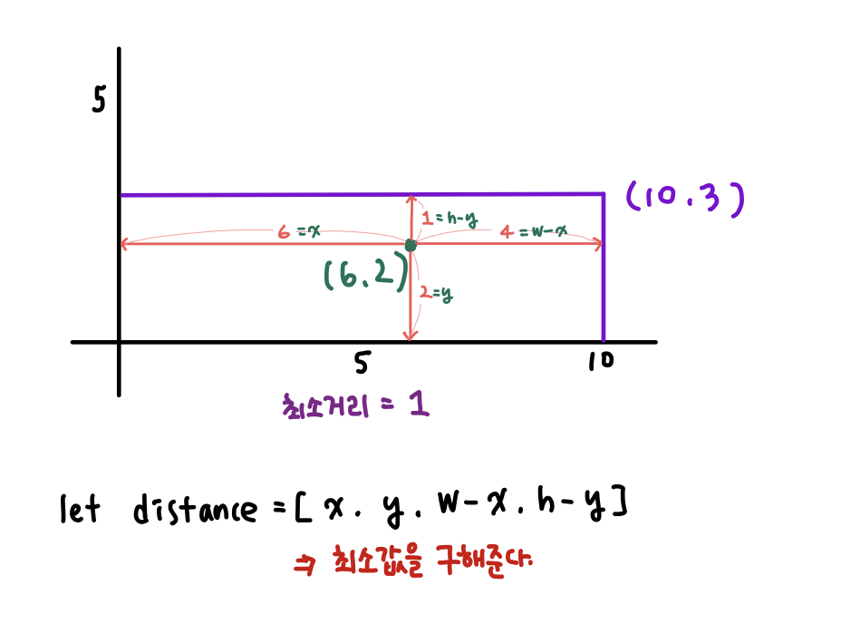

## 📮 1085 직사각형에서 탈출
---

### 문제
한수는 지금 (x, y)에 있다. 직사각형은 각 변이 좌표축에 평행하고, 왼쪽 아래 꼭짓점은 (0, 0), 오른쪽 위 꼭짓점은 (w, h)에 있다. 직사각형의 경계선까지 가는 거리의 최솟값을 구하는 프로그램을 작성하시오.

<br />

### 입력
첫째 줄에 x, y, w, h가 주어진다.

<br />

### 출력
첫째 줄에 문제의 정답을 출력한다.

<br />

### Code
```javascript
const fs = require('fs');
const input = fs.readFileSync("example.txt").toString().trim().split(" ");
let [x, y, w, h] = input.map(i => Number(i));

let distance = [x, y, w - x, h - y];
console.log(Math.min(...distance))
```

<br />

### Comment
