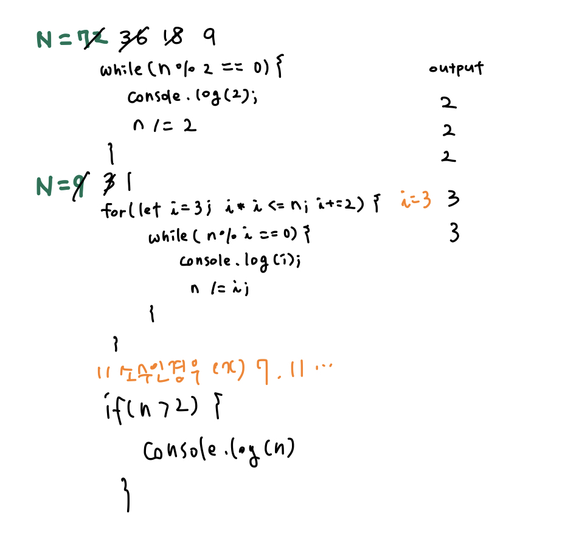

## 📮 11653 소인수분해
---

### 문제
정수 N이 주어졌을 때, 소인수분해하는 프로그램을 작성하시오.

<br />

### 입력
첫째 줄에 정수 N (1 ≤ N ≤ 10,000,000)이 주어진다.

<br />

### 출력
N의 소인수분해 결과를 한 줄에 하나씩 오름차순으로 출력한다. N이 1인 경우 아무것도 출력하지 않는다.

<br />

### Code
```javascript
const fs = require('fs');
const input = fs.readFileSync("/dev/stdin").toString().trim().split("\n");

let num = Number(input[0]);

function factorization (n) {
  while(n % 2 == 0) {
    console.log(2);
    n /= 2;
  }

  for(let i = 3; i * i <= n; i += 2) {
    while(n % i == 0) {
      console.log(i);
      n /= i;
    }
  }

  if (n > 2) {
    console.log(n)
  }
}

factorization(num)
```

<br />

### Comment
1. 소수구해서 나누기 ➡️ ⏱ 시간초과
    * 주어진 숫자의 소수를 구해서 반복문을 돌면서 나눠준다. 
2. 나누는 수를 1씩 증가시켜 나누기 ➡️ ⏱ 260ms 
3. 나누는 수의 범위를 줄이기 ➡️ ⏱ 168ms
  * 주어진 수를 2로 나누어 떨어질 때까지 나누어 주고 나면 홀수가 남게 된다.
  * 남은 수를 홀수로 나누어 떨어질 때까지 나누어 준다. 
  