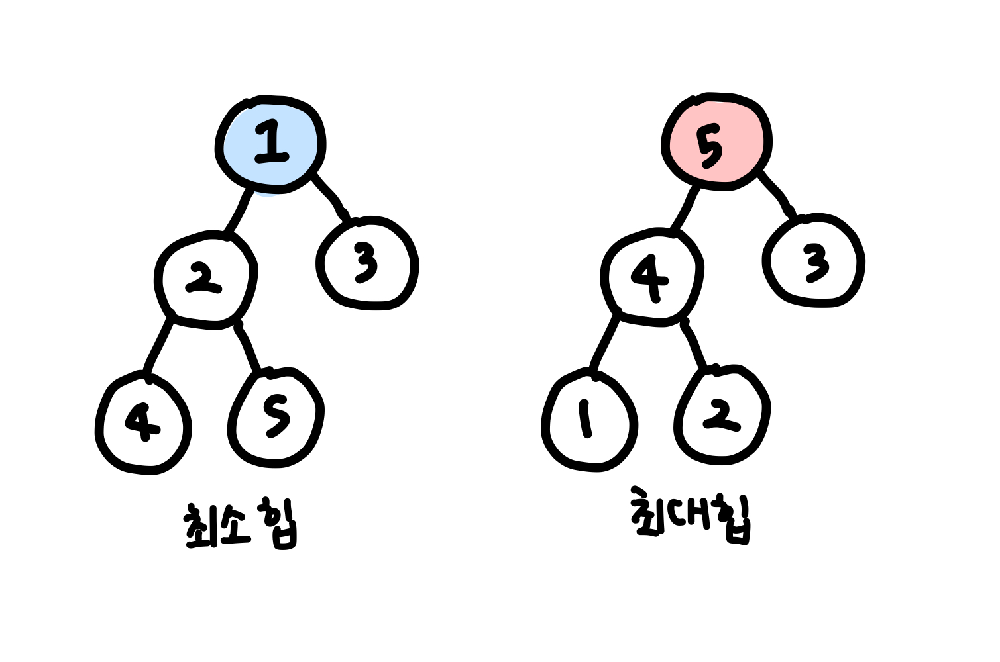

## 📮 11279 최대힙
---

### 문제
널리 잘 알려진 자료구조 중 최대 힙이 있다. 최대 힙을 이용하여 다음과 같은 연산을 지원하는 프로그램을 작성하시오.

배열에 자연수 x를 넣는다.
배열에서 가장 큰 값을 출력하고, 그 값을 배열에서 제거한다.
프로그램은 처음에 비어있는 배열에서 시작하게 된다.

<br />

### 입력
첫째 줄에 연산의 개수 N(1 ≤ N ≤ 100,000)이 주어진다. 다음 N개의 줄에는 연산에 대한 정보를 나타내는 정수 x가 주어진다. 만약 x가 자연수라면 배열에 x라는 값을 넣는(추가하는) 연산이고, x가 0이라면 배열에서 가장 큰 값을 출력하고 그 값을 배열에서 제거하는 경우이다. 입력되는 자연수는 231보다 작다.

<br />

### 출력
입력에서 0이 주어진 회수만큼 답을 출력한다. 만약 배열이 비어 있는 경우인데 가장 큰 값을 출력하라고 한 경우에는 0을 출력하면 된다.

<br />

### Code
```javascript
const fs = require('fs');
const input = fs.readFileSync("/dev/stdin").toString().trim().split('\n');

const N = Number(input.shift());
const arr = input.map(v => Number(v));

class Heap {
  constructor() {
    this.items = [];
  }

  swap(index1, index2) {
    let temp = this.items[index1];
    this.items[index1] = this.items[index2];
    this.items[index2] = temp;
  }

  getParentIndex(index) {
    return Math.floor((index - 1) / 2);
  }

  getLeftChildIndex(index) {
    return index * 2 + 1;
  }

  getRightChildIndex(index) {
    return index * 2 + 2;
  }

  getParent(index) {
    return this.items[this.getParentIndex(index)];
  }

  getLeftChild(index) {
    return this.items[this.getLeftChildIndex(index)];
  }

  getRightChild(index){
    return this.items[this.getRightChildIndex(index)];
  }

  size() {
    return this.items.length;
  }
}

class MaxHeap extends Heap {
  isEmpty() {
    return this.size() === 0;
  }

  insert(item) {
    this.items.push(item);
    this.bubbleUp();
  }

  delete() {
    const data = this.items[0];

    if(this.size() > 1) {
      const last = this.size() - 1;
      this.swap(0, last);
      this.items.pop();
      this.bubbleDown();
    } else {
      this.items.pop();
    }
    return data;
  }

  bubbleUp() {
    let index = this.size() - 1;
    const currentData = this.items[index]; 

    while(index > 0) {
      if(currentData < this.getParent(index)) break;

      this.swap(this.getParentIndex(index), index);
      index = this.getParentIndex(index);
    }
    this.items[index] = currentData;
  }

  bubbleDown() {
    let index = 0;
    const currentData = this.items[index];

    while(index < this.size()) {
      if(this.getLeftChildIndex(index) >= this.size()) break;

      const rightChildData = this.getRightChild(index);
      
      const biggerIndex =
        rightChildData !== undefined && rightChildData >= this.getLeftChild(index)
        ? this.getRightChildIndex(index)
        : this.getLeftChildIndex(index)

        
        const biggerData = this.items[biggerIndex];

      if(currentData >= biggerData) break;

      this.items[index] = biggerData;
      index = biggerIndex;
    }
    this.items[index] = currentData;
  }
}

const maxHeap = new MaxHeap();
const answer = [];

for(let i = 0; i < N; i++) {
  if(arr[i] === 0) {
    if(!maxHeap.isEmpty()) {
      answer.push(maxHeap.delete())
    } else {
      answer.push(0)
    }
  } else {
    maxHeap.insert(arr[i])
  }
}

console.log(answer.join("\n"))
```

<br />

### Comment
* 힙 - 최댓값이나 최솟값을 찾아내는 연산을 빠르게 하기 위해 고안된 **완전이진트리**를 기본으로 한 자료구조
* 최대힙 : 가장 큰 값이 root에 위치, 모든 노드는 자기 부모 노드가 자기보다 큰 값을 가지고 있다. 
* 최소힙 : 가장 작은 값이 root에 위치, 모든 노드는 자기 부모 노드보다 큰 값을 가지고 있다. 
