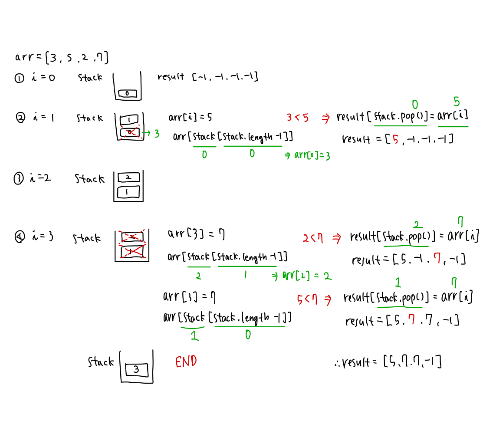

## 📮 17298 오큰수

---

### 문제

크기가 N인 수열 A = A1, A2, ..., AN이 있다. 수열의 각 원소 Ai에 대해서 오큰수 NGE(i)를 구하려고 한다. Ai의 오큰수는 오른쪽에 있으면서 Ai보다 큰 수 중에서 가장 왼쪽에 있는 수를 의미한다. 그러한 수가 없는 경우에 오큰수는 -1이다.

예를 들어, A = [3, 5, 2, 7]인 경우 NGE(1) = 5, NGE(2) = 7, NGE(3) = 7, NGE(4) = -1이다. A = [9, 5, 4, 8]인 경우에는 NGE(1) = -1, NGE(2) = 8, NGE(3) = 8, NGE(4) = -1이다.

<br />

### 입력

첫째 줄에 수열 A의 크기 N (1 ≤ N ≤ 1,000,000)이 주어진다. 둘째 줄에 수열 A의 원소 A1, A2, ..., AN (1 ≤ Ai ≤ 1,000,000)이 주어진다.

<br />

### 출력

총 N개의 수 NGE(1), NGE(2), ..., NGE(N)을 공백으로 구분해 출력한다.

<br />

### Code

```javascript
const fs = require("fs");
const input = fs.readFileSync("/dev/stdin").toString().trim().split("\n");

const N = Number(input[0]);
let arr = input[1].split(" ").map((v) => Number(v));

let stack = [];
let result = Array(N).fill(-1);

for (let i = 0; i < N; i++) {
  while (stack.length && arr[stack[stack.length - 1]] < arr[i]) {
    result[stack.pop()] = arr[i];
  }
  stack.push(i);
}
console.log(result.join(" "));
```

<br />

### Comment


