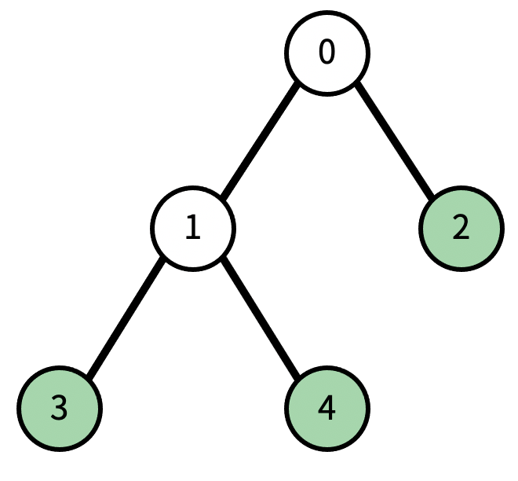
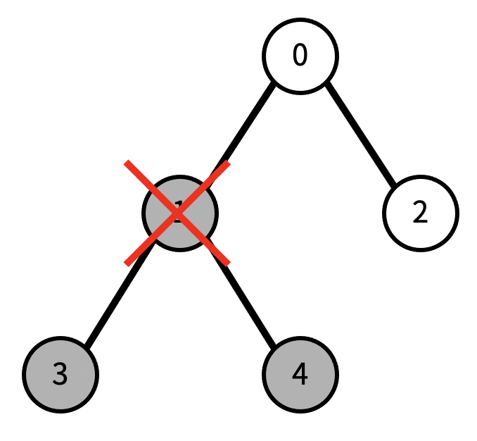
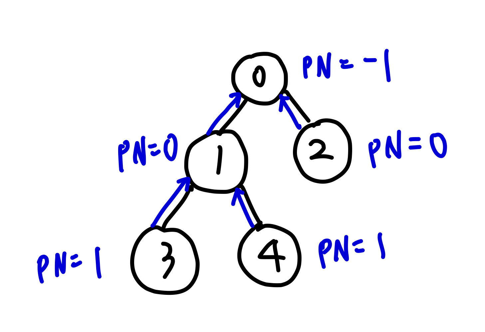

## 📮 1068 트리
---

### 문제
트리에서 리프 노드란, 자식의 개수가 0인 노드를 말한다.

트리가 주어졌을 때, 노드 하나를 지울 것이다. 그 때, 남은 트리에서 리프 노드의 개수를 구하는 프로그램을 작성하시오. 노드를 지우면 그 노드와 노드의 모든 자손이 트리에서 제거된다.

예를 들어, 다음과 같은 트리가 있다고 하자.

현재 리프 노드의 개수는 3개이다. (초록색 색칠된 노드) 이때, 1번을 지우면, 다음과 같이 변한다. 검정색으로 색칠된 노드가 트리에서 제거된 노드이다.

이제 리프 노드의 개수는 1개이다.

<br />

### 입력
첫째 줄에 트리의 노드의 개수 N이 주어진다. N은 50보다 작거나 같은 자연수이다. 둘째 줄에는 0번 노드부터 N-1번 노드까지, 각 노드의 부모가 주어진다. 만약 부모가 없다면 (루트) -1이 주어진다. 셋째 줄에는 지울 노드의 번호가 주어진다.

<br />

### 출력
첫째 줄에 입력으로 주어진 트리에서 입력으로 주어진 노드를 지웠을 때, 리프 노드의 개수를 출력한다.


<br />

### Code
```javascript
const fs = require('fs');
const input = fs.readFileSync("/dev/stdin").toString().trim().split('\n');

const N = input.shift();
const removeNode = Number(input.pop());
const parentNode = input[0].split(' ').map(Number);

let tree = [];
let rootNode;
let count = 0;

parentNode.forEach((node, index) => {
  if(node === -1) {
    rootNode = index;
    return;
  }
  if (!tree[node]) tree[node] = [];
  tree[node].push(index);
})

function dfs(node) {
  if(rootNode === removeNode) return 0;
  if(!tree[node]) {
    count++;
    return;
  }
  tree[node].forEach((nodeNum) => {
    if(nodeNum === removeNode) {
      if(tree[node].length === 1) count++;
      return;
    }
    dfs(nodeNum);
  });
  return count;
}

console.log(dfs(rootNode));
```

<br />

### Comment
1. tree 만들기
* 입력받은 부모노드 배열을 반복문으로 돌면서 tree를 만들어준다. 
* node가 -1일경우는 부모노드가 없기 때문에 현재 index를 넣어주고 return한다. 
* tree배열에 해당 node의 값이 없을 경우 새 배열을 만들어준후 index를 push해준다. 
```javascript
parentNode.forEach((node, index) => {
  if(node === -1) {
    rootNode = index;
    return;
  }
  if (!tree[node]) tree[node] = [];
  tree[node].push(index);
})
// tree = [[1, 2], [3, 4]]
```


2. dfs 깊이 우선 탐색
* count : 리프노드 count
* rootNode와 removeNode가 같으면 모든 자식 노드들이 제거되기 때문에 0 반환
* `tree[node]`가 없는 경우는 자기 자신이 리프노드이기 때문에 카운트
* `tree[node]` 반복문을 돌면서 nodeNum과 removeNode가 같은 경우일 때
  `tree[node]`의 길이가 1인경우 카운트 한후 return한다. 
```javascript
let count = 0;

function dfs(node) {
  if(rootNode === removeNode) return 0;
  if(!tree[node]) {
    count++;
    return;
  }
  tree[node].forEach((nodeNum) => {
    if(nodeNum === removeNode) {
      if(tree[node].length === 1) count++;
      return;
    }
    dfs(nodeNum);
  });
  return count;
}
```