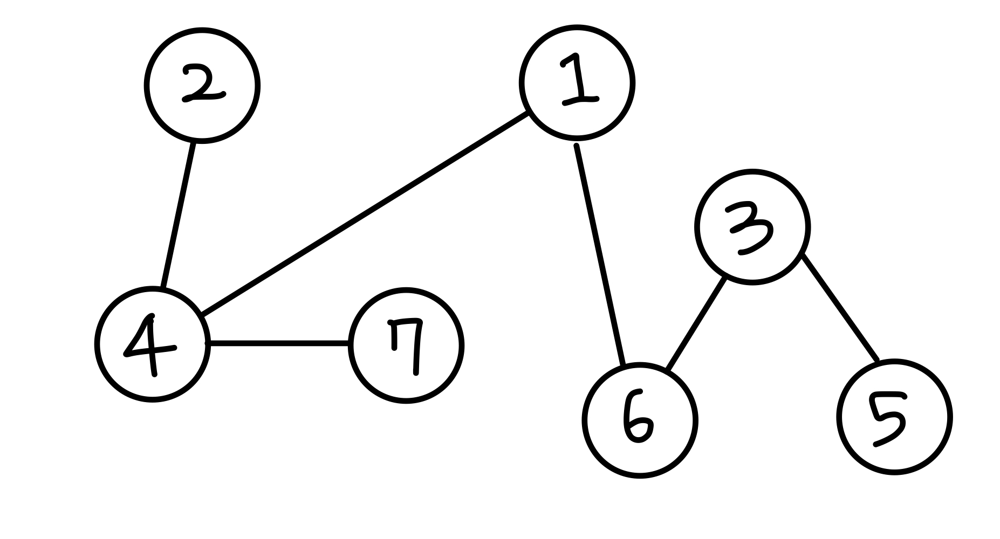

## 📮 11725 트리의 부모 찾기
---

### 문제
루트 없는 트리가 주어진다. 이때, 트리의 루트를 1이라고 정했을 때, 각 노드의 부모를 구하는 프로그램을 작성하시오.

<br />

### 입력
첫째 줄에 노드의 개수 N (2 ≤ N ≤ 100,000)이 주어진다. 둘째 줄부터 N-1개의 줄에 트리 상에서 연결된 두 정점이 주어진다.

<br />

### 출력
첫째 줄부터 N-1개의 줄에 각 노드의 부모 노드 번호를 2번 노드부터 순서대로 출력한다.

<br />

### Code
```javascript
const fs = require('fs');
const input = fs.readFileSync("/dev/stdin").toString().trim().split('\n');

const N = Number(input.shift());
const graph = Array.from({ length: N + 1 }, () => new Array());

input.forEach(v => {
  const [from, to] = v.split(" ").map(Number);
  graph[from].push(to);
  graph[to].push(from); 
});

let visited = Array(N + 1).fill(0);

function bfs() {
  const queue = [];
  visited[1] = 1;
  for (let next of graph[1]) { 
    visited[next] = 1; 
    queue.push(next); 
  }

  while(queue.length) {
    const node = queue.shift(); 
    for(let next of graph[node]) { 
      if(visited[next]) continue; 
      visited[next] = node;
      queue.push(next);
    }  
  }
}
bfs()

visited = visited.slice(2);
let result = "";
visited.forEach(c => result += `${c}\n`)
console.log(result)
```

<br />

### Comment
1. graph 만들어준다. ( 각 노드가 연결된 정보를 표현, 2차원 배열)
  * `[1, 6]`일 경우 `graph[1]`에 `6`을 넣어주고, `graph[6]`에 `1`을 넣어준다.
  ```javascript
  graph = [ 
    [],          
    [ 6, 4 ], // 1번 노드와 인접한 노드
    [ 4 ], // 2번 노드와 인접한 노드
    [ 6, 5 ], // 3번 노드와 인접한 노드
    [ 1, 2, 7 ], // 4번 노드와 인접한 노드
    [ 3 ], // 5번 노드와 인접한 노드
    [ 1, 3 ], // 6번 노드와 인접한 노드
    [ 4 ] // 7번 노드와 인접한 노드
  ] 
  ```
2. `visited`: 방문을 체크하고 부모 노드를 넣어주는 배열
3. queue에 탐색을 시작할 노드를 넣어준다. 
4. 모든 노드를 탐색할 때까지 반복문을 순회한다. ➡️ `queue.length === 0`
5. node : 현재 탐색 노드
  * 이미 방문한 노드이면 건너 뛴다. 
  * 노드를 방문하면 해당 노드의 부모 노드를 넣어준다. ( 부모노드 : 현재 탐색 노드)
  * `queue`에 자식 노드의 값을 넣어준다. 
6. visited 배열의 1,2 요소를 제거하고 출력한다. 
```javascript
  visited = [ 0, 1, 4, 6, 1, 3, 1, 4 ]
```

