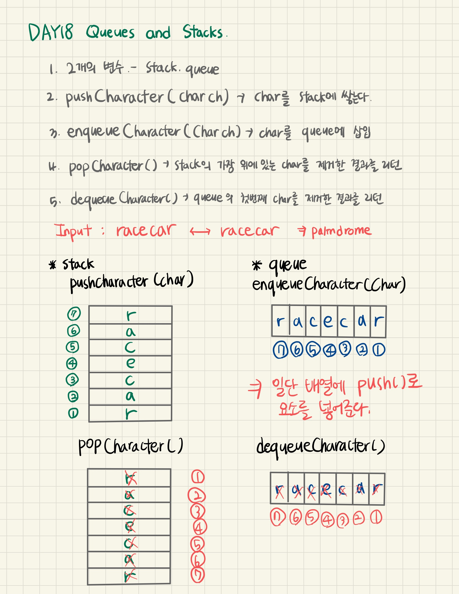

## Day 18 Queues and Stacks

---

Welcome to Day 18! Today we're learning about Stacks and Queues. Check out the Tutorial tab for learning materials and an instructional video!

A palindrome is a word, phrase, number, or other sequence of characters which reads the same backwards and forwards. Can you determine if a given string, _s_, is a palindrome?

To solve this challenge, we must first take each character in _s_, enqueue it in a queue, and also push that same character onto a stack. Once that's done, we must dequeue the first character from the queue and pop the top character off the stack, then compare the two characters to see if they are the same; as long as the characters match, we continue dequeueing, popping, and comparing each character until our containers are empty (a non-match means isn't a palindrome).

Write the following declarations and implementations:

1. Two instance variables: one for your _stack_, and one for your _queue_.
2. A void pushCharacter(char ch) method that pushes a character onto a stack.
3. A void enqueueCharacter(char ch) method that enqueues a character in the _queue_ instance variable.
4. A char popCharacter() method that pops and returns the character at the top of the _stack_ instance variable.
5. A char dequeueCharacter() method that dequeues and returns the first character in the _queue_ instance variable.

<br />

**Input Format**

You do not need to read anything from stdin. The locked stub code in your editor reads a single line containing string _s_. It then calls the methods specified above to pass each character to your instance variables.

<br />

**Constraints**

- _s_ is composed of lowercase English letters.

<br />

**Output Format**

You are not responsible for printing any output to stdout.  
If your code is correctly written and _s_ is a palindrome, the locked stub code will print _The word, s, is a palindrome._; otherwise, it will print _The word, s, is not a palindrome._

<br />

**Sample Input**

```
racecar
```

<br />

**Sample Output**

```
The word, racecar, is a palindrome.
```

<br />

**Solution**

> 주어진 문자열이 palindrome인지 아닌지를 판별하여 결과를 출력한다.

<br />

**Code**

```javascript
function Solution() {
  //Write your code here
  let stack = [];
  let queue = [];

  this.pushCharacter = function (char) {
    stack.push(char);
  };
  this.enqueueCharacter = function (char) {
    queue.push(char);
  };
  this.popCharacter = function () {
    return stack.pop();
  };
  this.dequeueCharacter = function () {
    return queue.shift();
  };
}
```

<br />

**Review**

> 🔹 stack, queue 변수를 선언해서 만든 배열에 인자로 넘어온 char를 `push()`로 넣어준다.  
> 🔹 `pop()` : 배열의 마지막 요소를 제거하고, 제거한 요소를 반환  
> 🔹 `shift()` : 배열의 첫번째 요소를 제거하고, 제거한 요소를 반환

<br />



<br />

**Word**

> palindrome : 거꾸로 읽어도 제대로 읽는 것과 같은 문장이나 낱말(A SANTA AT NASA)
