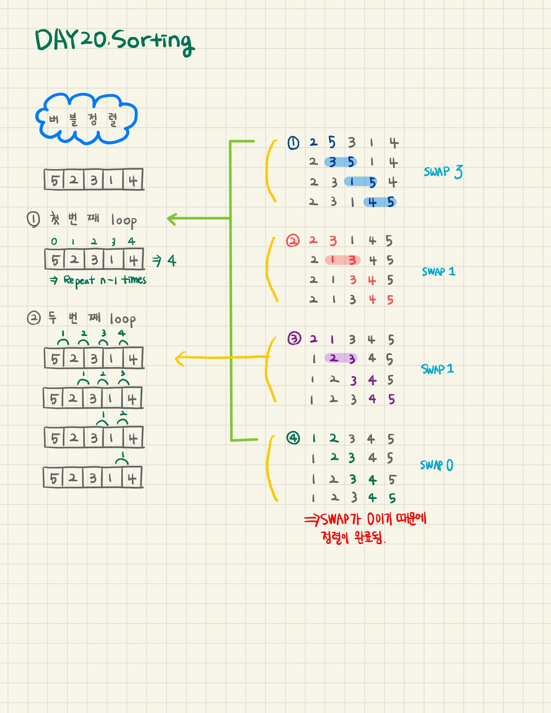

## Day 20 sorting

---

**Objective**  
Today, we're discussing a simple sorting algorithm called Bubble Sort. Check out the Tutorial tab for learning materials and an instructional video!

Consider the following version of Bubble Sort:

```javascript
for (int i = 0; i < n; i++) {
    // Track number of elements swapped during a single array traversal
    int numberOfSwaps = 0;

    for (int j = 0; j < n - 1; j++) {
        // Swap adjacent elements if they are in decreasing order
        if (a[j] > a[j + 1]) {
            swap(a[j], a[j + 1]);
            numberOfSwaps++;
        }
    }

    // If no elements were swapped during a traversal, array is sorted
    if (numberOfSwaps == 0) {
        break;
    }
}
```

<br />

**Task**  
Given an array, _a_, of size _n_ distinct elements, sort the array in ascending order using the Bubble Sort algorithm above. Once sorted, print the following 3 lines:

1. Array is sorted in numSwaps swaps.
   where _numSwaps_ is the number of swaps that took place.
2. First Element: firstElement
   where _fisrtElement_ is the first element in the sorted array.
3. Last Element: lastElement
   where _lastElement_ is the last element in the sorted array.
   **Hint:** To complete this challenge, you will need to add a variable that keeps a running tally of all swaps that occur during execution.

<br />

**Example**  
a = [4, 3, 2, 1]

```
original a: 4 3 1 2
round 1  a: 3 1 2 4 swaps this round: 3
round 2  a: 1 2 3 4 swaps this round: 2
round 3  a: 1 2 3 4 swaps this round: 0
```

In the first round, the 4 is swapped at each of the 3 comparisons, ending in the last position. In the second round, the 3 is swapped at 2 of the 3 comparisons. Finally, in the third round, no swaps are made so the iterations stop. The output is the following:

```
Array is sorted in 5 swaps.
First Element: 1
Last Element: 4
```

<br />

**Input Format**

The first line contains an integer, _n_, the number of elements in array _a_.
The second line contains _n_ space-separated integers that describe a[0], a[1], ..., a[n - 1].

<br />

**Constraints**

- 2 &#8804; _n_ &#8804; 600
- 1 &#8804; a[_i_] &#8804; 2 x 10^6, where 0 &#8804; _i_ &#60; _n_

<br />

**Output Format**

Print the following three lines of output:

1. Array is sorted in numSwaps swaps.
   where _numSwaps_ is the number of swaps that took place.
2. First Element: firstElement
   where _firstElement_ is the first element in the sorted array.
3. Last Element: lastElement
   where _lastElement_ is the last element in the sorted array.

<br />

**Sample Input 0**

```
3
1 2 3
```

**Sample Output 0**

```
Array is sorted in 0 swaps.
First Element: 1
Last Element: 3
```

**Explanation 0**

The array is already sorted, so 0 swaps take place and we print the necessary 3 lines of output shown above.

<br />

**Sample Input 1**

```
3
3 2 1
```

**Sample Output 1**

```
Array is sorted in 3 swaps.
First Element: 1
Last Element: 3
```

**Explanation 1**

The array a = [3, 2, 1] is not sorted, so we perform the following 3 swaps. Each line shows _a_ after each single element is swapped.

1. [3, 2, 1] ➡️ [2, 3, 1]
2. [2, 3, 1] ➡️ [2, 1, 3]
3. [2, 1, 3] ➡️ [1, 2, 3]

After 3 swaps, the array is sorted.

<br />

**Solution**

> 주어진 배열을 버블정렬을 통해 정렬하여 swap한 횟수와 정렬한 배열의 첫번째 요소, 마지막 요소를 출력한다.

<br />

**Code**

```javascript
function main() {
  const n = parseInt(readLine().trim(), 10);

  const a = readLine()
    .replace(/\s+$/g, "")
    .split(" ")
    .map((aTemp) => parseInt(aTemp, 10));

  // Write your code here
  let aLength = a.length;
  let temp;
  let numSwaps = 0;

  for (let i = 0; i < aLength; i++) {
    for (let j = 0; j < aLength - 1 - i; j++) {
      if (a[j] > a[j + 1]) {
        numSwaps++;
        temp = a[j];
        a[j] = a[j + 1];
        a[j + 1] = temp;
      }
    }
    if (numSwaps == 0) {
      break;
    }
  }

  console.log(`Array is sorted in ${numSwaps} swaps.`);
  console.log(`First Element: ${a[0]}`);
  console.log(`Last Element: ${a[aLength - 1]}`);
}
```

<br />

**Review**

> 🔹 첫번째 loop : 배열의 길이에서 1을 뺀 만큼 반복문을 실행한다. (배열의 모든 요소)  
> 🔹 두번째 loop : 배열의 요소를 두개씩 묶어서 숫자를 비교하면서 반복문을 실행한다.  
> 🔹 `swap` 하는 경우 : 요소의 오른쪽 숫자보다 왼쪽 숫자가 더 클 경우 두 숫자의 자리를 바꿔준다.  
> 🔹 `temp` : 두 요소의 자리를 바꾸기 위한 임시 저장 변수  
> 🔹 `numSwaps` : swap 하는 횟수가 0이면 정렬의 완료를 뜻한다.


